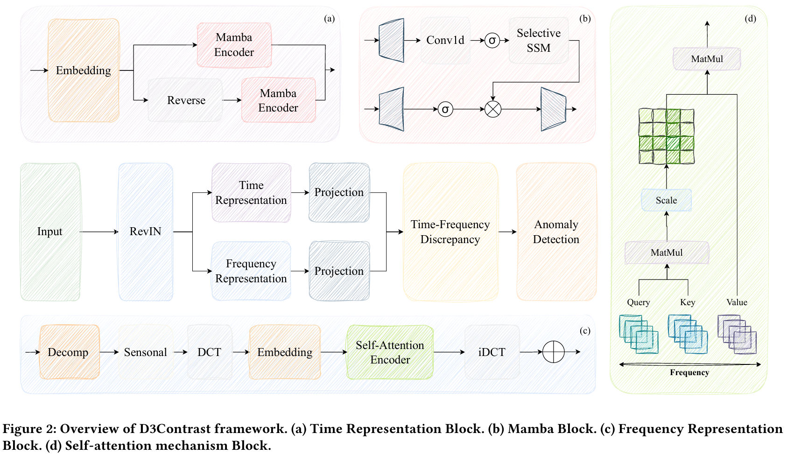
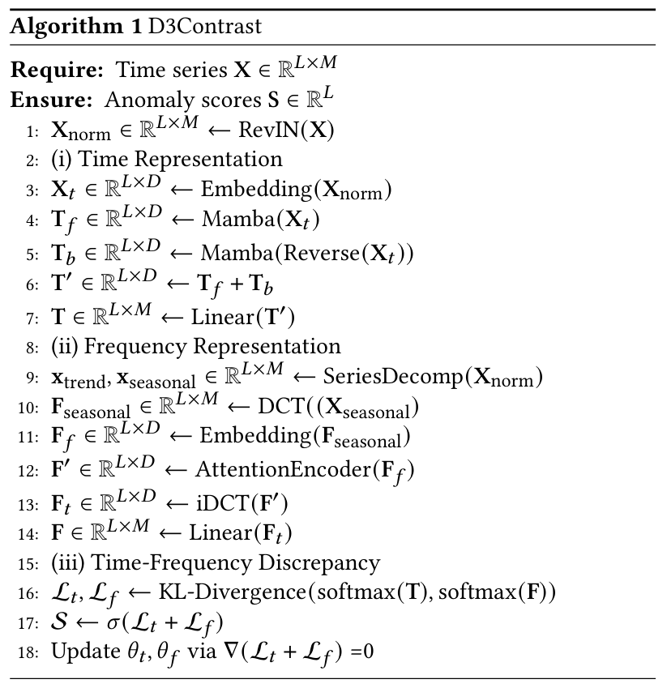
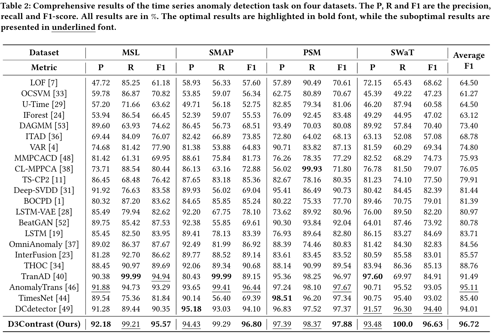

# D3Contrast

The repo is the official implementation for the paper: **D3Contrast: Dual Domain Discrepancy Modeling with Time-Frequency Contrast for Time Series Anomaly Detection**.


## Overall Architecture

<p align="center">

</p>

The pseudo-code of D3Contrast is as simple as the following:

<p align="center">

</p>

## Usage 

1. Install Pytorch and necessary dependencies.

```
pip install -r requirements.txt
```

1. The datasets can be obtained from [here](https://drive.google.com/drive/folders/1RaIJQ8esoWuhyphhmMaH-VCDh-WIluRR?usp=sharing).

2. Train and evaluate the model. We provide all the above tasks under the folder ./scripts/. You can reproduce the results as the following examples:

```
bash ./scripts/MSL.sh
```


### Challenging Multivariate Time Series Forecasting Benchmarks (Avg Results)

<p align="center">

</p>


## Citation

If you find this repo helpful, please cite our paper. 

```
@article{weiD3Contrast,
author = {Guangyu Wei, Huichuan Huang, Wenlong Sun, Junjie Zheng, Keyang Yu, Aimin Feng},
title = {D3Contrast: Dual Domain Discrepancy Modeling with Time-Frequency Contrast for Time Series Anomaly Detection},
year = {2025}
```
