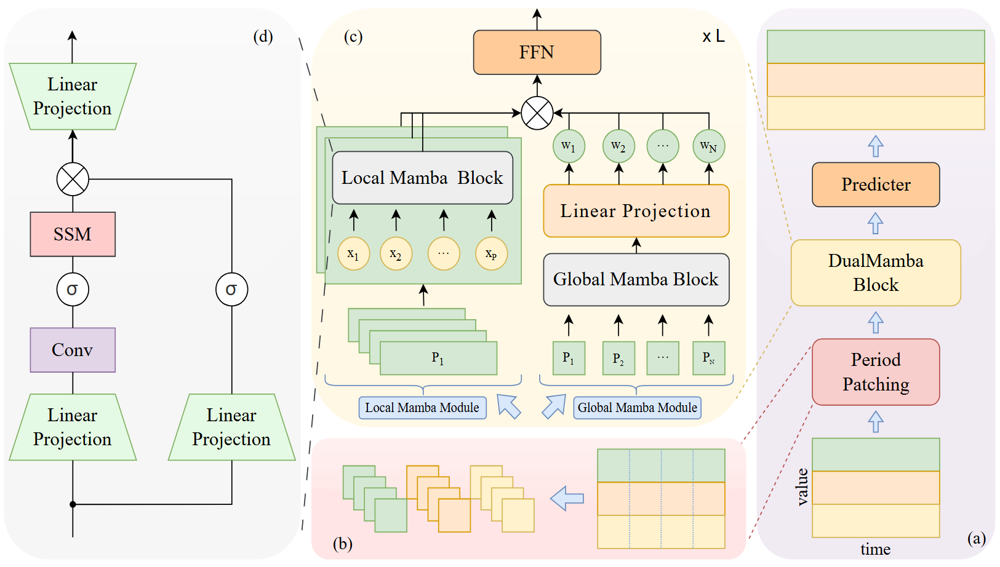
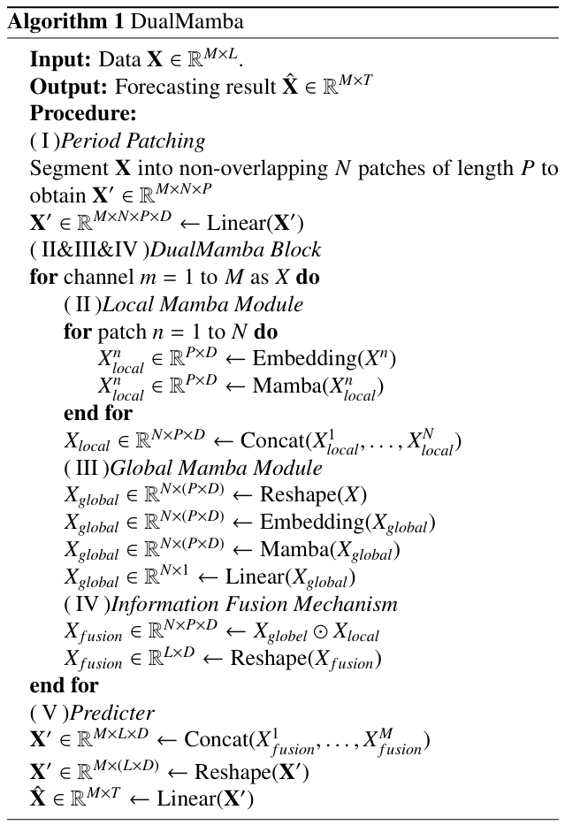
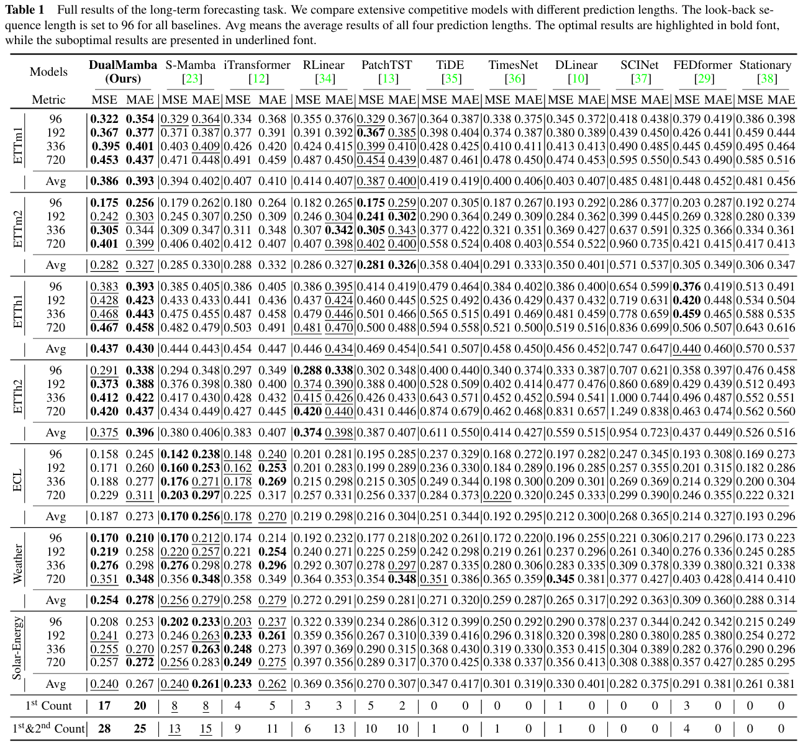

# DualMamba

The repo is the official implementation for the paper: **DualMamba: Patch-Based Model with Dual Mamba for Long-Term Time Series Forecasting**.


## Overall Architecture

<p align="center">

</p>

The pseudo-code of DualMamba is as simple as the following:

<p align="center">

</p>

## Usage 

1. Install Pytorch and necessary dependencies.

```
pip install -r requirements.txt
```

1. The datasets can be obtained from [Google Drive](https://drive.google.com/file/d/1l51QsKvQPcqILT3DwfjCgx8Dsg2rpjot/view?usp=drive_link) or [Tsinghua Cloud](https://cloud.tsinghua.edu.cn/f/2ea5ca3d621e4e5ba36a/).

2. Train and evaluate the model. We provide all the above tasks under the folder ./scripts/. You can reproduce the results as the following examples:

```
bash ./scripts/ETTh1.sh
```


### Challenging Multivariate Time Series Forecasting Benchmarks (Avg Results)

<p align="center">

</p>


## Citation

If you find this repo helpful, please cite our paper. 

```
@article{Guangyu WEI:0,
author = {Guangyu WEI, Huichuan HUANG, Zhiqing ZHONG, Wenlong SUN, Yonghao WAN, Aimin FENG},
title = {DualMamba: Patch-Based Model with Dual Mamba for Long-Term Time Series Forecasting},
publisher = {Front. Comput. Sci.},
year = {2025},
journal = {Frontiers of Computer Science},
url = {https://journal.hep.com.cn/fcs/EN/abstract/article_62593.shtml},
doi = {10.1007/s11704-025-41293-5}
}
```
